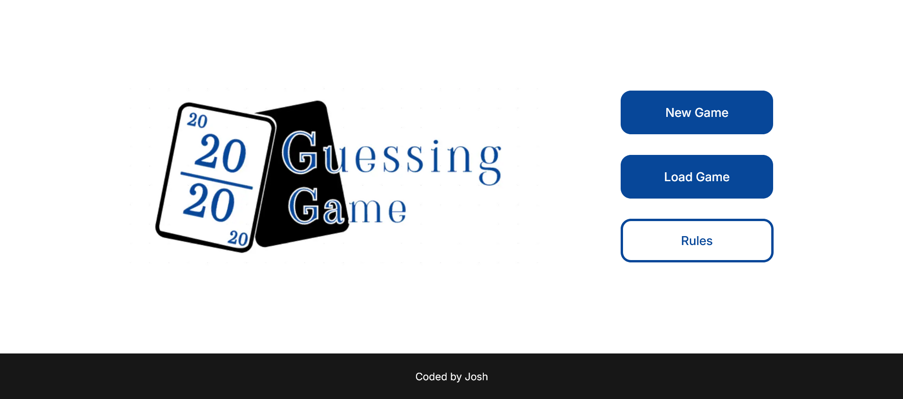

# Guessing Game 2

This is an automated score keeping web-app for the Guessing Game card game. It utilizes the brower's localstorage to enabled loading previously played games.



## Built with

- [React](https://react.dev/) - JavaScript library
- [Next.js](https://nextjs.org) - React framework

## Installation and Setup

- Install [Node.js](https://nodejs.org) on your system.

- Open the directory inside the terminal and run the following command to start the development server:

```bash
npm run dev
```

## User Guide

The main menu consists of three options:

- Select "New Game" to start a new game.
- Select "Load Game" to load a previously started game.
- Select "Rules" to read through the rules of the game.

## Credits

Author: [JMantei](https://github.com/JMantei)
